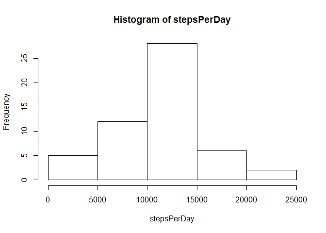
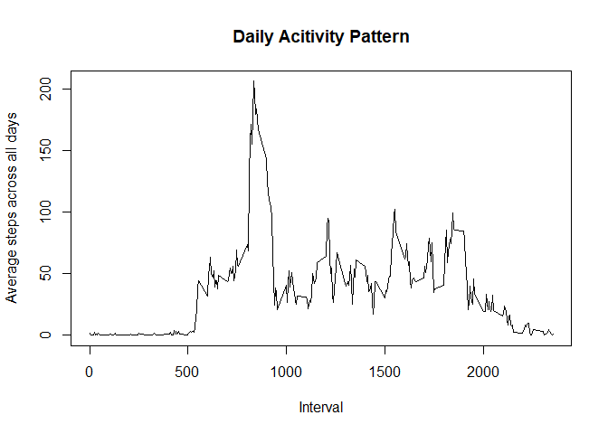
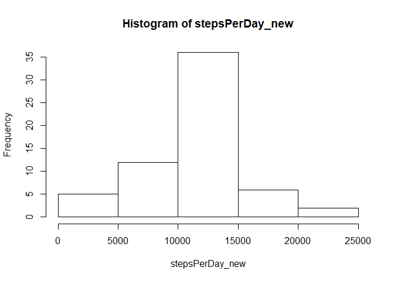
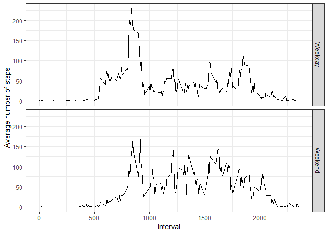

## Loading and preprocessing the data

```r
# unzip the file
if (!file.exists("activity")) {
    unzip("activity.zip")
}

# read in data
act <- read.csv("activity.csv")

# format date column
act$date <- as.Date(act$date)
```


## What is mean total number of steps taken per day?

```r
# remove NAs
act.1 <- na.omit(act)

# Calculate the total number of steps taken per day
stepsPerDay <- tapply(act.1$steps, act.1$date, sum)

# Make a histogram of the total number of steps taken each day
hist(stepsPerDay)
```

<!-- -->

```r
# calculate the mean and median of the total number of steps taken per day
mean(stepsPerDay) 
```

```
## [1] 10766.19
```

```r
median(stepsPerDay)
```

```
## [1] 10765
```


## What is the average daily activity pattern?

```r
library(dplyr)
```

```
## 
## Attaching package: 'dplyr'
```

```
## The following objects are masked from 'package:stats':
## 
##     filter, lag
```

```
## The following objects are masked from 'package:base':
## 
##     intersect, setdiff, setequal, union
```

```r
dailyActivity <- act.1 %>%
    group_by(interval) %>%
    summarise(avgSteps = mean(steps))

# a times eries plot
plot(dailyActivity$interval, dailyActivity$avgSteps, type = "l",
     main = "Daily Acitivity Pattern",
     xlab = "Interval",
     ylab = "Average steps across all days")
```

<!-- -->

Which 5-minute interval, on average across all the days in the dataset, contains the maximum number of steps?  Interval 835.

```r
dailyActivity[which(dailyActivity$avgSteps == max(dailyActivity$avgSteps)),1]
```

```
## # A tibble: 1 x 1
##   interval
##      <int>
## 1      835
```


## Imputing missing values

How many rows contain NA?

```r
colSums(is.na(act))
```

```
##    steps     date interval 
##     2304        0        0
```


Fill in all of the missing values with the mean for that 5-minute interval and create a new data set.

```r
# merge to create the column we need
act_new <- merge(dailyActivity, act, all = TRUE, by = "interval")

# replace NA in steps with the average steps in that interval
act_new$steps = ifelse(is.na(act_new$steps), act_new$avgSteps, act_new$steps)

# format the new data set
act_new <- arrange(act_new, date)
act_new <- select(act_new, -2)
head(act_new)
```

```
##   interval     steps       date
## 1        0 1.7169811 2012-10-01
## 2        5 0.3396226 2012-10-01
## 3       10 0.1320755 2012-10-01
## 4       15 0.1509434 2012-10-01
## 5       20 0.0754717 2012-10-01
## 6       25 2.0943396 2012-10-01
```


Make a histogram of the total number of steps taken each day and calculate the mean and median total number of steps taken per day using the new data set.

```r
stepsPerDay_new <- tapply(act_new$steps, act_new$date, sum)
hist(stepsPerDay_new)
```

<!-- -->

```r
mean(stepsPerDay_new)
```

```
## [1] 10766.19
```

```r
median(stepsPerDay_new)
```

```
## [1] 10766.19
```

The histogram and the median have changed, but the mean did not change.


## Are there differences in activity patterns between weekdays and weekends?
Create a new factor variable in the dataset with two levels “weekday” and “weekend” indicating whether a given date is a weekday or weekend day.

```r
act_new$weekday <- weekdays(act_new$date)
act_new$weekday <- with(act_new, ifelse(weekday == "Saturday" | weekday == "Sunday",
                                        weekday <- "Weekend",
                                        weekday <- "Weekday"))
act_new$weekday <- as.factor(act_new$weekday)
str(act_new)
```

```
## 'data.frame':	17568 obs. of  4 variables:
##  $ interval: int  0 5 10 15 20 25 30 35 40 45 ...
##  $ steps   : num  1.717 0.3396 0.1321 0.1509 0.0755 ...
##  $ date    : Date, format: "2012-10-01" "2012-10-01" ...
##  $ weekday : Factor w/ 2 levels "Weekday","Weekend": 1 1 1 1 1 1 1 1 1 1 ...
```


Make a panel plot containing a time series plot (i.e. type = "l") of the 5-minute interval (x-axis) and the average number of steps taken, averaged across all weekday days or weekend days (y-axis).

```r
library(ggplot2)

# create the dataframe for plotting
dailyActivity_new <- act_new %>%
    group_by(weekday, interval) %>%
    summarise(avgSteps = mean(steps))

# plot
ggplot(dailyActivity_new, aes(x=interval, y=avgSteps)) +
    geom_line()+
    facet_grid(weekday~.) +
    labs(y="Average number of steps",
         x="Interval") +
    theme_bw()
```

<!-- -->
